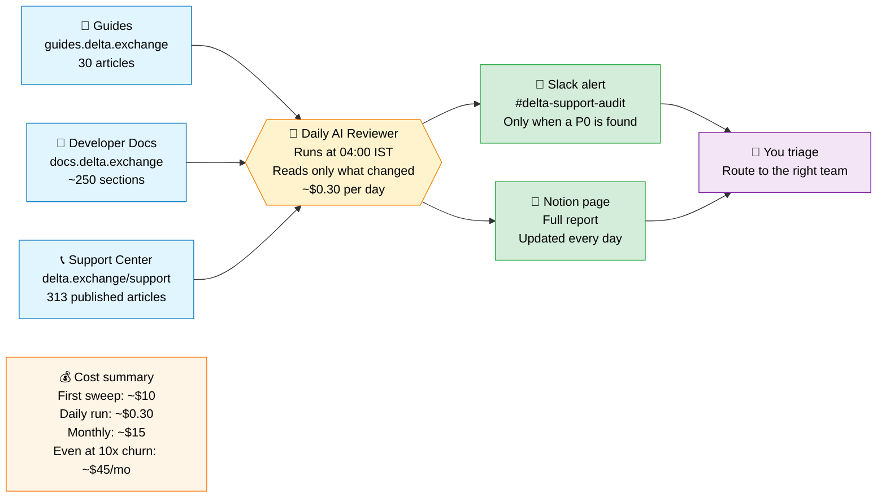
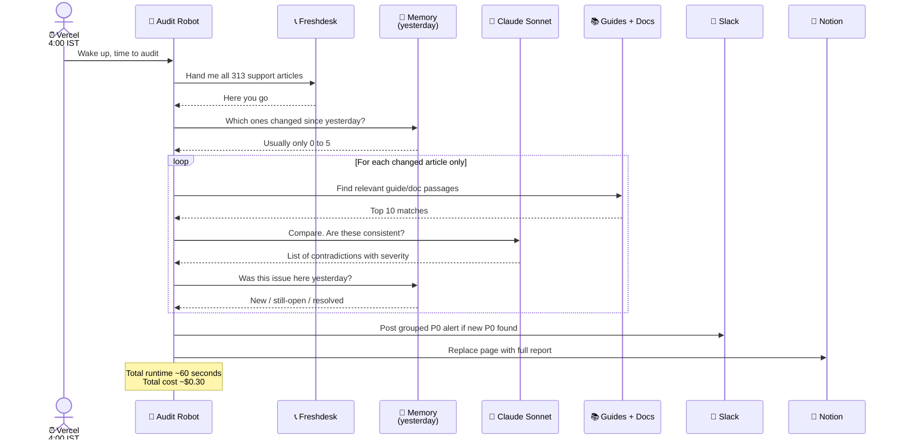
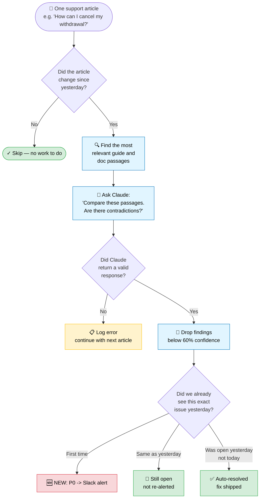
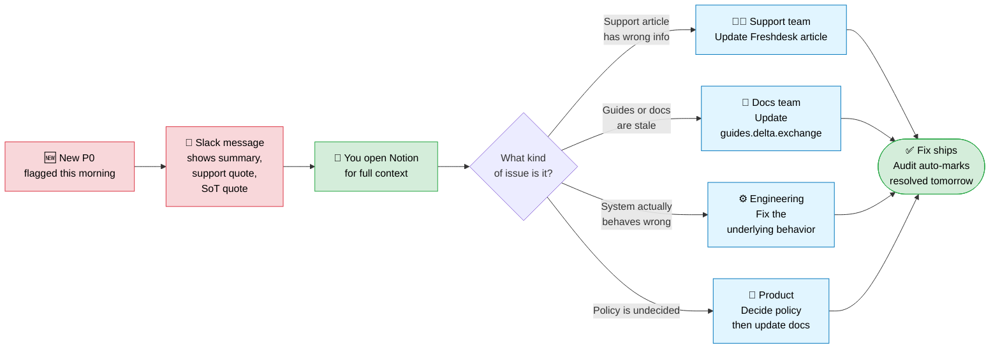

# Delta Support Audit — Product team explainer

A 4-view Whimsical board for the product team. Each block below is Mermaid code — paste each one onto a fresh Whimsical canvas section and Whimsical auto-converts it into a native flowchart.

**Audience:** non-technical PMs.
**Key takeaway:** cost (~$15/month at typical churn) and how it scales.

---

## How to build this board in Whimsical

1. Create a new Whimsical board titled **"Delta Support Audit — How it works"**.
2. Type a section header on the canvas: **"1. What it does"**.
3. Copy block 1 below, click on the canvas under the header, paste. Whimsical converts to a flowchart.
4. Repeat for blocks 2, 3, 4 with their respective headers.
5. Drop the "PM talking points" text (at the bottom of this file) as a sticky/text card to the right of the board.

---

## Block 1 — What it does (architecture overview)

Paste instruction: *Copy this block, click on the Whimsical canvas, paste.*

---

## Block 2 — What happens at 4am every day (sequence)

Paste instruction: *Copy this block, paste under the "2. Daily run" header.*

---

## Block 3 — How the AI judges one article

Paste instruction: *Copy this block, paste under the "3. Per-article pipeline" header.*

---

## Block 4 — What you do when something is found

Paste instruction: *Copy this block, paste under the "4. Triage routing" header.*

---

## PM talking points (drop as a sticky note next to the board)

**The pitch in one sentence:** A daily robot reads our support center, compares each article to the official guides and developer docs, flags real contradictions, and tells us which team should fix it.

**What makes it cheap:** it only re-reads what changed (about 0-5 articles per day on average). The AI cost is dominated by the *first sweep* of all 313 articles, which is a one-time ~$10. After that, the daily run is ~30¢.

**What it catches well:**
- Numbers that disagree (fee %, leverage cap, withdrawal limit)
- Procedures that disagree (what happens during maintenance, how KYC works)
- Topics our docs say exist but support hasn't covered yet (coverage gaps, run weekly)

**What it does NOT catch:**
- UI screenshots that drifted from the actual app
- Tone or wording style differences
- Region-specific edge cases (we explicitly skip Delta-Global-only content because we audit the India support center)

**Real example from the trial run** (use this when you demo): Our trial flagged that one support article said "users can only deposit USDT", while the user guide still said "BTC and USDT". The robot correctly identified that the *guide* was outdated (BTC deposits were discontinued) and routed the fix to the docs team — not the support team. That's the kind of routing accuracy that comes "free" with the prompt logic.

**Cost scaling table** (paste as a small table sticky):

| Scenario | Daily cost | Monthly |
|---|---|---|
| Quiet day (0 articles changed) | $0 | — |
| Typical (1-5 changed) | $0.05 - $0.25 | ~$5 |
| Busy week (10-15 changed/day) | $0.50 - $0.75 | ~$18 |
| Major rewrite (30+/day for a week) | $1 - $1.50 | ~$45 (one week only) |
| Plus weekly coverage sweep | +$3/week | +$12 |

**Where it runs:** Vercel (Hobby plan, free tier — well within free function-minute limits).

**Who built it:** internal tool, no external vendors except Anthropic (the AI) and Upstash (the memory store). Both pay-per-use, no commitments.
