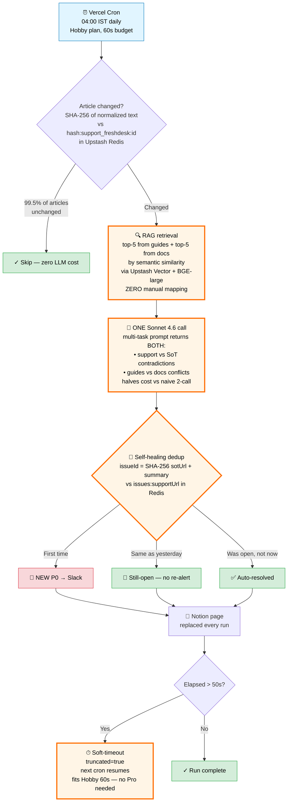

# Delta Support Audit — Engineering Flex Board

For Yatharth + Hashmeet. Single-glance read, <2 min.

## Whimsical structure

One main flowchart in the centre. Two sticky/text panels: problem framing on top, alternatives table on the right. The 3 highlighted (orange) nodes are the cool bits.

---

## The flowchart



---

## Panel A — Problem & Solution (top sticky)

```
PROBLEM
Support articles drift from guides + docs over months.
Numbers, fees, KYC steps, supported assets — silently
diverge. We had no daily check. Stale support content
costs us tickets, trust, and India-vs-Global confusion.

SOLUTION
A daily AI auditor. Reads only what changed (cheap).
Flags real contradictions. Routes to the right team
(Support / Docs / Engineering / Product). Self-heals
when fixes ship.

COST
First sweep: ~$10 (one-time, 313 articles)
Daily incremental: ~$0.30 (only changed articles audit)
Monthly: ~$15 typical, ~$45 worst case
```

---

## Panel B — Considered & Rejected (right sticky)

```
APPROACH                        WHY NOT
─────────────────────────────────────────────────────────
Manual content QA contractor    Slow, costly, doesn't
                                scale, no daily cadence

GPT-wrapper, full corpus        Expensive context, noisy,
in every prompt                 retrieval bias to last
                                page

Pinecone for vectors            Upstash already in stack;
                                fewer accounts to manage

Vercel Pro plan ($20/mo)        Soft-timeout state machine
                                fits Hobby. $0/mo. No
                                lock-in.

OpenAI text-embedding-3         Upstash Vector hosts
+ separate key                  BGE-large server-side.
                                One less key to rotate.

Two LLM calls per article       Multi-task prompt returns
(compare + conflict)            both arrays in one call.
                                50% cost saved.

Manual issue tracking           Self-healing dedup via
                                Redis. Auto-closes on
                                fix. Zero ops overhead.
```

---

## What to call out when walking them through it

1. **The orange nodes are the load-bearing cleverness.** Walk them in this order: RAG → multi-task LLM → self-healing dedup → soft-timeout.
2. **The 99.5%-skip stat is the cost story.** Daily incremental is only cheap because most articles don't change day-to-day.
3. **Self-healing dedup means zero issue-tracker ops.** No Linear board, no Jira, no manual closing. State lives in Redis, decays automatically when the fix lands.
4. **Soft-timeout is the "we don't pay $20/mo for Pro" trick.** Vercel Hobby's 60s is enough because the orchestrator returns gracefully at 50s and the next cron picks up.

## What to admit (so the flex is honest)

1. **12.5% false-positive rate at v2** (1 in 8 findings). Documented in `docs/prompt-changelog.md`. Tunable in M5.5.
2. **LLM phrases summaries non-deterministically**, so dedup occasionally misclassifies "same issue" as "new". Coarser dedup key is in the M6 backlog.
3. **Coverage detector found zero gaps** at threshold 0.85 — could be that support is genuinely well-covered, or that the threshold is wrong. Worth one more pass.
